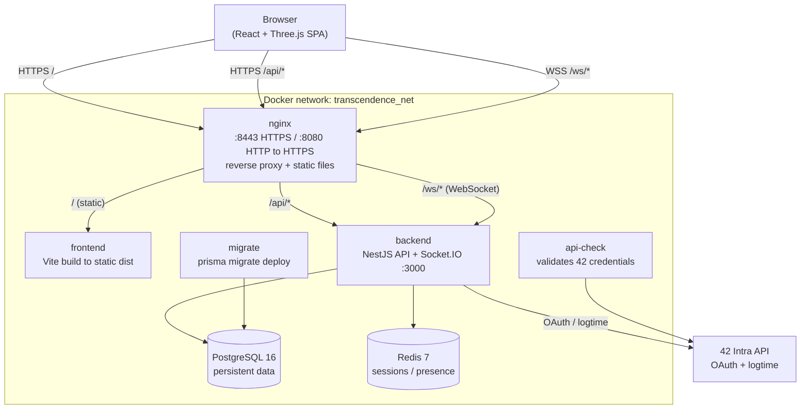
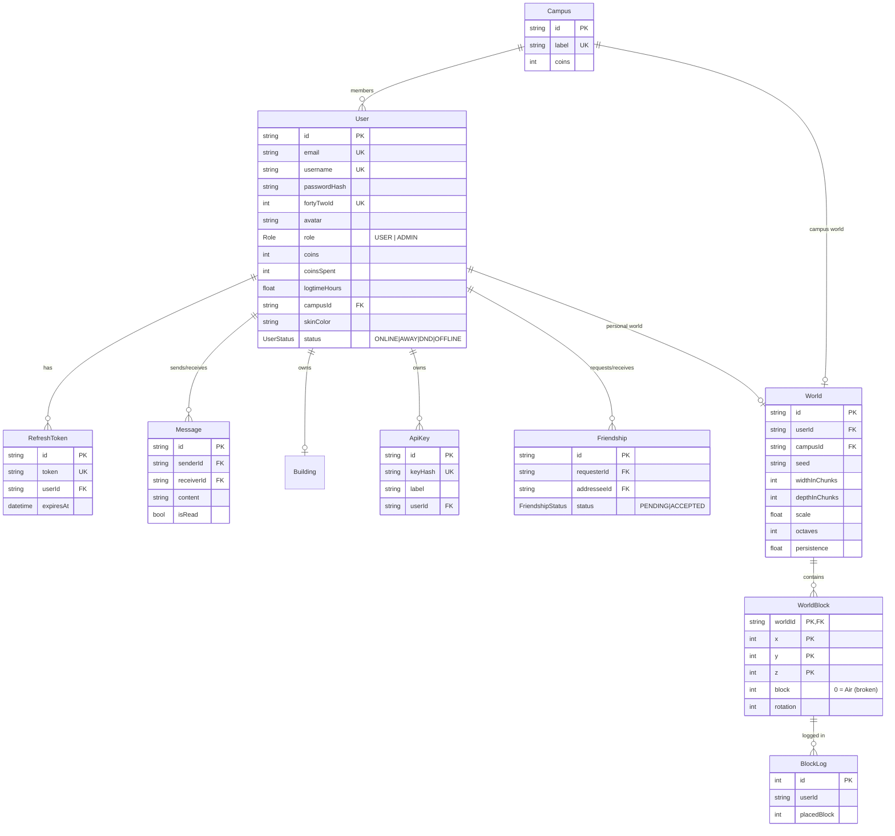
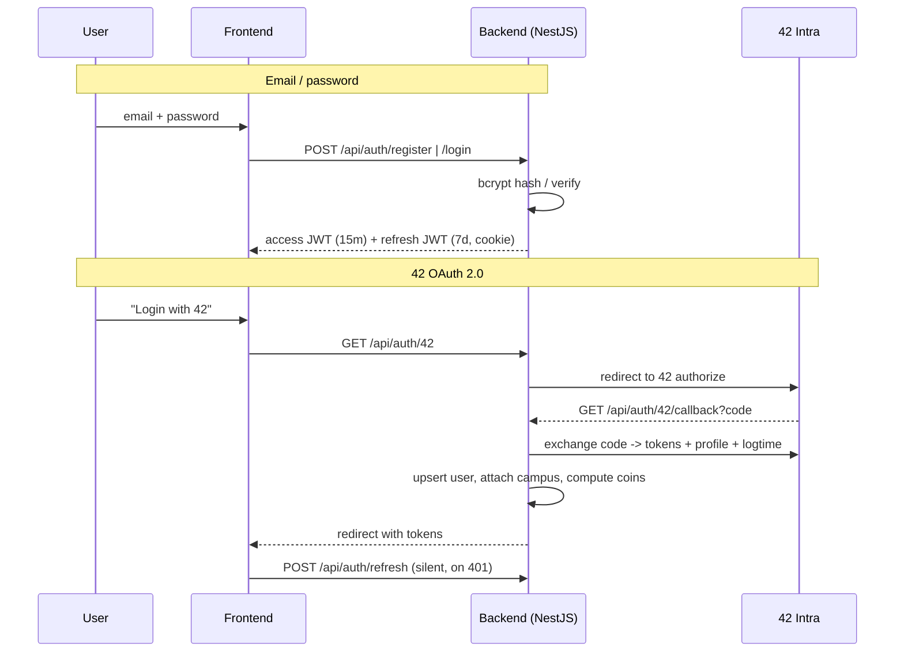
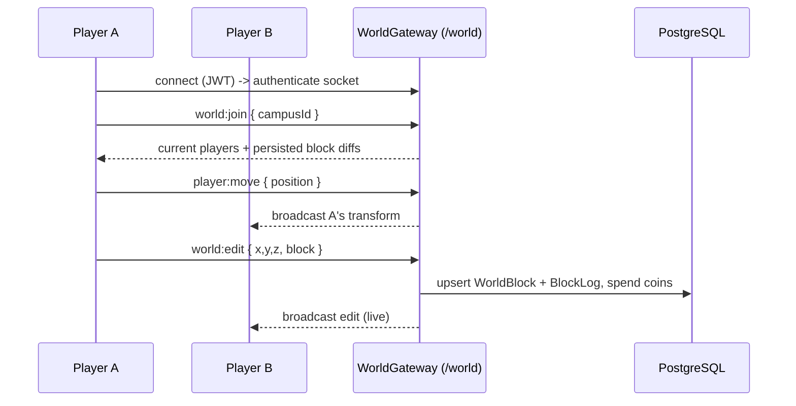

*This project has been created as part of the 42 curriculum by julcleme, sservant, sgil--de, trgascoi.*

# ft_transcendence — FT_VERSE

> A real-time, multiplayer **3D voxel world** where 42 students earn build-coins from their
> logtime and collaboratively shape a planet for their campus.

---

## Description

**ft_transcendence — FT_VERSE** is a full-stack web application built as the final project
of the 42 Common Core. Instead of the classic Pong, the team built a **shared 3D sandbox**: each
42 campus owns a procedurally-generated planet, and the students of that campus log in to **walk
around it as 3D avatars and build it together, block by block, in real time**.

The twist that ties the game to 42 life: **coins are earned from your real intra logtime**. The
more hours you log at the campus, the more blocks you can afford to place. Every placement is
persisted as a diff over the generated terrain, so the world a campus builds is permanent and
visible to everyone who joins.

### Key features

- **Procedural 3D worlds** — each campus gets a deterministic, seed-based terrain (noise),
  rendered with Three.js.
- **Collaborative voxel editing** — place and break blocks live; edits are broadcast to every
  player in the same campus room and stored in PostgreSQL.
- **Real-time multiplayer presence** — see other avatars move around the planet via WebSockets.
- **Logtime-based economy** — coins are derived from the player's 42 intra logtime; placing
  paid blocks spends them.
- **Dual authentication** — email/password (hashed + salted with bcrypt) **and** 42 OAuth 2.0.
- **Social layer** — friends (requests, accept, remove), online presence, and direct messaging.
- **Admin dashboard** — role-based user management (CRUD), signup analytics charts, campus
  management.
- **Internationalization** — full UI in English, French and Spanish with a live language switcher.

---

## Modules (target: 14 points — achieved: 15)

Each Major module = 2 pts, each Minor module = 1 pt.

| Category | Module | Type | Pts | How it was implemented |
|---|---|---|---|---|
| Web | Use a framework front **and** back | Major | 2 | **React 18** (frontend) + **NestJS 11** (backend). |
| Web | Real-time features (WebSockets) | Major | 2 | **Socket.IO** gateways: live player movement + collaborative block editing, with graceful (re)connection and concurrent-login eviction. |
| Web | User interaction (chat + profile + friends) | Major | 2 | Direct-message chat, profile pages, full friends system. |
| Web | Use an ORM | Minor | 1 | **Prisma** over PostgreSQL. |
| User Management | Standard user management & auth | Major | 2 | Profile edit, avatar upload (default avatar fallback), friends + online status, profile pages. |
| User Management | Remote auth — OAuth 2.0 | Minor | 1 | **42 intra OAuth 2.0** login. |
| User Management | Advanced permissions system | Major | 2 | `USER` / `ADMIN` roles, role-guarded admin endpoints, full user CRUD + role/password reset. |
| Accessibility & i18n | Multi-language (≥3 languages) | Minor | 1 | **i18next** with `en` / `fr` / `es`, live switcher, all UI text translatable. |
| Gaming & UX | Advanced 3D graphics | Major | 2 | **Three.js** via `@react-three/fiber` + `drei`: immersive voxel planet, instanced rendering, custom camera/controls. |
| | | **Total** | **15** | |

> The **voxel terrain engine + logtime-coin economy** is the original creative core of the project
> and is what differentiates it from a standard 42 web app.

---

## Architecture

All services run inside Docker and are reached through a single **nginx** entry point over HTTPS.



**Service startup order** (enforced via `depends_on` + healthchecks):
`postgres`/`redis` healthy -> `migrate` runs schema -> `api-check` validates 42 keys ->
`backend` boots -> `frontend` builds static assets -> `nginx` serves everything.

---

## Technical Stack

### Frontend
- **React 18** + **TypeScript** + **Vite** (build tooling, served as static files by nginx).
- **Three.js** + `@react-three/fiber` + `@react-three/drei` — the 3D world rendering.
- **Tailwind CSS v4** + **shadcn/ui** (Radix primitives) — styling & accessible components.
- **Zustand** — client state (auth, friends, settings, planet).
- **TanStack Query** — server-state caching.
- **socket.io-client** — real-time channels.
- **react-i18next** — internationalization (en/fr/es).
- **Recharts** — admin analytics charts.
- **GSAP / motion** — UI & camera animations.

### Backend
- **NestJS 11** + **TypeScript** — modular HTTP API and WebSocket gateways.
- **Prisma 5** ORM over **PostgreSQL 16**.
- **Redis 7** (`ioredis`) — sessions / presence / fast lookups.
- **Passport** strategies: `passport-local`, `passport-jwt`, `passport-oauth2` (42).
- **bcrypt** — password hashing (salted).
- **@nestjs/throttler** — rate limiting (100 req / 60 s).
- **helmet** — HTTP security headers.
- **multer** — avatar uploads (persisted volume, served via `/api/uploads`).
- **Socket.IO** — two gateways: `/world` (3D world) and friends/chat.

### Infrastructure
- **Docker Compose** — one-command deployment (`make`).
- **nginx 1.25** — HTTPS reverse proxy (self-signed certs), static hosting, WebSocket upgrade.
- **PostgreSQL**, **Redis**, dedicated **migrate** and **api-check** init containers.

### Why these choices
- **NestJS + Prisma**: strong typing end-to-end and a clean module boundary per domain
  (auth, users, friends, world, admin, campus) — easy to split work across the team.
- **React + Three.js (`@react-three/fiber`)**: lets the 3D scene be expressed as React
  components, so HUD and 3D world share the same state stores.
- **Redis**: presence and socket auth need sub-millisecond reads that shouldn't hit Postgres.

---

## Database Schema

PostgreSQL, managed by Prisma migrations.



**Design notes**
- A `World` belongs to either a **Campus** (the shared planet) or a single **User**.
- `WorldBlock` is stored as a **diff over the generated terrain**: only edited voxels are
  persisted. A broken block is kept as `block = 0` (Air) so destroyed ground survives a reload.
- `Building` is a lightweight per-user marker on the campus map.

---

## Authentication flows



---

## Real-time world flow



---

## Voxel Engine & Technical Deep-Dive

This section presents the detailed technical architecture of the client-side 3D voxel engine, player physics/controls, and procedural terrain generation.

---

### 1. 3D Rendering (Three.js) & Client-Side Storage

The FT_VERSE voxel engine is designed to deliver a real-time, interactive, and modifiable 3D world while maintaining a high frame rate in the browser.

#### Instanced Rendering (`THREE.InstancedMesh`)
Rather than instantiating a separate 3D mesh for each block (which would saturate the CPU and GPU with thousands of draw calls), the engine uses instanced rendering via `THREE.InstancedMesh`.
* **Grouping by Block Type**: Visible blocks in a chunk are sorted by block type (e.g., Grass, Water, Stone) in [ChunkRenderer.tsx](frontend/src/ui/three/scenes/worldScene/ChunkRenderer.tsx).
* **One Instance per Type**: For each non-empty block type, a single `ChunkBlockTypeRenderer` component is rendered with a single `THREE.InstancedMesh`.
* **Transformation Matrices**: In `useLayoutEffect`, each block is assigned a `Matrix4` encoding its global position, rotation (decoded using 2 bits per axis), and scale (slightly scaled to `0.505` to eliminate rendering gaps between blocks).
* **GPU Update**: Calling `mesh.instanceMatrix.needsUpdate = true` flags Three.js to upload the matrices to video memory (VRAM).
* **Selective Shadows**: Cast and receive shadows are enabled on all blocks except water (`Block.Water`), to maintain a realistic visual appearance.

#### Major Voxel Engine Optimizations
1. **Adjacency Culling / Visible Face Culling (`isBlockExposed`)**: A block is only rendered if at least one of its 6 faces is exposed to a transparent or empty block (Air, Water). If a block is completely enclosed by opaque blocks, it is excluded from the instanced mesh's rendering list.
2. **Version-Based Memoization (`useMemo` keyed on `chunk?.version`)**: The list of instances to render for each chunk is memoized. When a player places or breaks a block, the `version` property of the chunk (and adjacent chunks if the block is on a border) is incremented. This triggers the recalculation of instances only for the modified chunks, avoiding rebuilding the scene geometry on every frame.
3. **Frustum Culling**: The engine explicitly calls `computeBoundingSphere()` and `computeBoundingBox()` on each `InstancedMesh`. This allows Three.js to automatically cull blocks located outside the active camera's field of view.

#### Data Structure & Local Storage
The client-side storage hierarchy optimizes RAM usage by leveraging terrain redundancy:

```
LocalMap (1D Grid of Chunks)
  └── Chunk 16x64x16 (Vertical column)
        └── 4x SubChunks 16x16x16 (Lazy Allocated Segment)
```

* **Lazy Allocation in [SubChunk.ts](frontend/src/types/maps/SubChunk.ts)**: A `SubChunk` (16x16x16 blocks) starts in a uniform state (`isUniform = true`, `uniformBlock = Block.Air`). As long as no different block is placed inside, it consumes minimal memory. Once a different block is placed, a typed `Uint16Array(4096)` array (representing $16^3$ entries) is allocated to store each voxel individually. This technique saves up to 90% of RAM for deep underground solid chunks and empty air chunks.
* **Coordinate Mapping via Bit Shifts**:
  * Inside a `SubChunk`, the flat 1D index of a block `(x, y, z)` is calculated using fast bitwise operations: `x + (z << 4) + (y << 8)`.
  * In [Chunk.ts](frontend/src/types/maps/Chunk.ts), the global height `y` (from 0 to 63) is mapped to the sub-chunk index using a bit shift `y >> 4` (division by 16) and to the local vertical coordinate using a bitwise mask `y & 15` (modulo 16).
* **Flat Array Representation in [LocalMap.ts](frontend/src/types/maps/LocalMap.ts)**: The global map `LocalMap` stores chunks in a flat 1D array of size `widthInChunks * depthInChunks`. Accessing is done via `chunkX + (chunkZ * widthInChunks)`.
* **Local vs. Global Lookup Optimization**:
  * Global block queries (`getGlobalBlock`) convert global world coordinates into a chunk index using `Math.floor(globalX / Chunk.WIDTH)`.
  * During the exposure check (`isBlockExposed`), the engine first checks if adjacent blocks belong to the same local chunk. If they do, it directly queries the local chunk array, bypassing global calculations and map lookups for over 90% of queries.

#### Planet Surface Preview (Planet Selection Scene)
To display interactive, rotating planetary models in the [PlanetSelectionScene.tsx](frontend/src/ui/three/scenes/PlanetSelectionScene.tsx) rail, rendering the full-scale voxel maps (typically $256 \times 256$ columns of blocks) is prohibitive for browser performance. The engine solves this by generating a lightweight preview model:
* **Downsampling & Raycasting in [createDemoPlanetMap.ts](frontend/src/ui/three/scenes/planetSelection/createDemoPlanetMap.ts)**:
  * The procedural map's 64-block flat borders (`BORDER_SIZE = 64`) are cropped out so that the preview voxel grid spans the entire visible surface.
  * The remaining terrain is downsampled to a configurable resolution (default: `32x32` preview voxels).
  * For each cell, the engine performs a downward raycast from `MAX_HEIGHT = 63` to `0`, combining procedural biomes, simulated forest canopy (`Block.Leaves` generated at `baseHeight + 3` based on coordinate hashes), and the user edits overlay (`editsMap`).
  * The first non-air block found is registered. The height and RGB color values of all blocks matching the cell coordinates are averaged to produce a single `PreviewVoxel`.
* **Base Mesh & Tinting in [SelectablePlanet.tsx](frontend/src/ui/three/objects/SelectablePlanet.tsx)**:
  * A standard `[1, 1, 1]` cube mesh is rendered at the center of the planet object.
  * The base cube is styled with a `baseColor` representing the average RGB color of all `PreviewVoxel`s on the planet. This ensures that flat areas where no extruded voxel faces are drawn match the terrain's color instead of rendering grey.
* **3D Cube Face Mapping & Instancing in [PlanetPreviewFaces.tsx](frontend/src/ui/three/objects/selectablePlanet/PlanetPreviewFaces.tsx)**:
  * Since the selector camera only views the planets from the top, front, and right sides, the engine only renders 3 faces of the cube (Top, Right, Front) to save draw calls and vertices.
  * The `32x32` grid is divided into three `16x16` quadrants:
    - **Top Face**: The top-left quadrant (`x < 16 && z < 16`), extruding upward along the Y axis.
    - **Right Face**: The top-right quadrant (`x >= 16 && z < 16`), mapped and wrapped down the right side of the cube, extruding rightward along the X axis.
    - **Front Face**: The bottom-left quadrant (`x < 16 && z >= 16`), mapped and wrapped down the front side of the cube, extruding forward along the Z axis.
  - The columns are rendered using `THREE.InstancedMesh` with unit box geometry (`BoxGeometry args={[1, 1, 1]}`) scaled and positioned in [VoxelFace.tsx](frontend/src/ui/three/objects/selectablePlanet/VoxelFace.tsx) based on the relative voxel heights.
  - **Edge & Corner Seam Filling ([VoxelFiller.tsx](frontend/src/ui/three/objects/selectablePlanet/VoxelFiller.tsx))**:
    - When voxel columns of different heights meet along the edges and corners where the cube faces intersect, ugly visual gaps and hollow spaces would appear.
    - To prevent this, the engine dynamically generates intermediate filler voxels using [useFillerVoxels.ts](frontend/src/ui/three/objects/selectablePlanet/useFillerVoxels.ts):
      - **Edges ([generateEdges.ts](frontend/src/ui/three/objects/selectablePlanet/generateEdges.ts))**: For each slice along an edge (Top-Right, Top-Front, and Right-Front), the engine compares the height of the two adjacent voxels, computes their minimum height $R$, and generates a quarter-circle/cylindrical wedge pattern of filler voxels ($i^2 + j^2 \leq R^2$). This fills the crease with a smooth, rounded edge.
      - **Corners ([generateCorner.ts](frontend/src/ui/three/objects/selectablePlanet/generateCorner.ts))**: At the main corner where all three visible faces meet, the engine takes the minimum height $R$ of the three adjacent corner voxels and generates a spherical octant pattern ($i^2 + j^2 + k^2 \leq R^2$) of filler voxels.
    - These filler voxels are rendered in a single draw call via `THREE.InstancedMesh` within `VoxelFiller.tsx`, ensuring a completely seamless and solid planet model with minimal performance overhead.

---

### 2. Player Controls & Movement Physics

Player physics and controls combine responsive inputs with a three-dimensional bounding box (AABB) collision system.

#### Keyboard Inputs & Pointer Lock
* **State Tracking (`usePlayerInput`)**: Directional keys (W, A, S, D) and Space are listened to globally on the `window` object and stored in a mutable reactive reference `keysRef.current`.
* **Contextual Inputs**: Input controls are ignored when the user is typing in a text field (e.g., chat or friend search) using the `isEditableTarget` utility function.
* **Pointer Lock**: Mouse movement controls camera rotation. The cursor is captured using `PointerLockControls`. Keyboard shortcuts (`Escape`, `ControlLeft`, or `KeyE`) allow freeing the cursor to interact with the HUD UI (inventory, chat, admin panel) and relocking it with a click.

#### Collision Detection & Axis-by-Axis Sliding (AABB)
The player is represented by a 3D bounding box (AABB) of radius `PLAYER_RADIUS` and height $1.8$ blocks (the player is approximately 1 block tall).
* **Three-Dimensional Detection in [playerCollision.ts](frontend/src/ui/three/objects/player/playerCollision.ts)**: The `checkCollisionAt` function tests the 4 corners of the player's bounding box at the target horizontal coordinates. For each corner, it iterates vertically from the player's feet (`Math.floor(playerY)`) to the top of their head (`Math.ceil(playerY + 1.8)`) querying `LocalMap.getGlobalBlock`. If any solid block is found, a collision is detected.
* **Axis-by-Axis Sliding in [usePlayerMovement.ts](frontend/src/ui/three/objects/player/usePlayerMovement.ts)**: When diagonal movement leads to a collision, the engine resolves the movement independently on each axis:
  ```typescript
  if (!hit(nextX, nextZ)) {
    // Free movement
    playerRef.current.position.x = nextX;
    playerRef.current.position.z = nextZ;
  } else if (!hit(nextX, playerRef.current.position.z)) {
    // Slide along the X axis
    playerRef.current.position.x = nextX;
  } else if (!hit(playerRef.current.position.x, nextZ)) {
    // Slide along the Z axis
    playerRef.current.position.z = nextZ;
  }
  ```
  This prevents the player from getting stuck when walking diagonally against a wall.

#### Gravity & Ground Snapping
* **Constant Gravity in [usePlayerVertical.ts](frontend/src/ui/three/objects/player/usePlayerVertical.ts)**: At each frame, vertical velocity decreases based on the gravity constant (`velocityRef.current.y -= PLAYER_GRAVITY * delta`).
* **Jumping**: If the player presses `Space` and `isGroundedRef` is true, a vertical jump force (`PLAYER_JUMP_FORCE`) is applied.
* **Ground Height Calculation in [playerTerrain.ts](frontend/src/ui/three/objects/player/playerTerrain.ts)**: The `getGroundHeightAt` function maps the player's position to global grid coordinates `(globalX, globalZ)` and scans downward from their current `y` coordinate. It locates the highest solid block (neither air nor water) and returns that altitude plus a height offset (`PLAYER_HEIGHT_OFFSET`).
* **Snapping & Landing**: If the player's vertical coordinate falls below the ground height, the player is snapped to the ground, their vertical velocity is set to 0, and `isGrounded` is set to true.

---

### 3. Procedural Terrain Generation via Perlin Noise

Planetary topology and biomes are generated 100% deterministically client-side from a planet-specific seed string.

#### Mathematical Mechanics of Perlin Noise
The engine incorporates a custom two-dimensional Perlin noise class `Perlin2D.ts`.
1. **Deterministic Initialization**: From the seed string, a pseudorandom number generator (`seedrandom`) initializes a 256-value permutation table shuffled using the Fisher-Yates algorithm. This table is duplicated to 512 entries to avoid modulo operations during lookups.
2. **Quintic Fade Curve**: To eliminate grid artifacts and ensure smooth transitions, the fractional coordinate is smoothed using Ken Perlin's quintic fade polynomial:
   $$f(t) = 6t^5 - 15t^4 + 10t^3$$
3. **Bilinear Interpolation**: Noise gradients at the four cell corners are calculated using dot products and combined via linear interpolations (*lerp*) based on horizontal and vertical fade factors. The resulting noise value is strictly between `-1.0` and `1.0`.

#### Heightmap Generation (fBm)
Raw terrain height is calculated in `IslandMap.getBiomeHeightRaw` using a fractal noise technique called **Fractional Brownian Motion (fBm)**, which superimposes multiple octaves of noise:
$$Height(x, z) = BaseHeight + Relief \times \sum_{i=0}^{Octaves-1} Perlin2D(x \times scale \times lac^{i}, z \times scale \times lac^{i}) \times pers^{i}$$
* **Octave Parameters**:
  * `Lacunarity` ($lac \approx 2$): Doubles the noise frequency at each successive octave, adding finer geographic details.
  * `Persistence` ($pers \approx 0.35$ to $0.5$): Multiplies the noise amplitude at each octave, reducing the impact of high frequencies to preserve global shape.
* **Normalization & Smoothing**: The accumulated noise is normalized to the $[0, 1]$ range and smoothed using a S-curve (smoothstep) before being scaled by the biome's `variationRange` and `baseHeight`.

#### Distance Masks & Island Constraints
To force the center of map to be blank, two distance-based masks are computed in `IslandMap.getPositionWeights`:
1. **Flat Center Mask (`wFlat`)**: Targets the center area of the map (typically 64x64 blocks). Inside this area, `wFlat` is `1.0` and decays smoothly (smoothstep) over a 16-block transition (1 chunk) to `0.0`. This mask forces the central spawn zone to be a flat plains region (altitude 12) where players can easily build and socialize.
2. **Border Mask (`wBorder`)**: Computes block distance to the closest border. If the distance is less than 64 blocks, the terrain height is smoothly blended down to the default ground level (altitude 10), ensuring the island fades into the void at the borders.

#### Biome Distribution & Blending
Biome types are determined in `IslandMap.getBiomeAt` using a second, independent noise generator (`this.biomePerlin` initialized with the seed `seed + "-biome"`).
* **Biome Assignment**: The smoothed, normalized noise value maps to a biome type:
  * $Noise < 0.38$: Desert
  * $0.38 \leq Noise < 0.46$: Plains
  * $0.46 \leq Noise < 0.65$: Forest
  * $Noise \geq 0.65$: Mountain
* **Center Biome Forcing**: The biome noise value is blended with `wFlat` to guarantee that the central spawn area is always a Plains biome.
* **Height Blending**: To prevent steep, unrealistic vertical cliffs at biome borders (e.g., transitioning directly from flat plains to a 22-block high mountain), final heights are linearly interpolated. The engine evaluates the raw height of each biome at the point `(x, z)` and performs a weighted interpolation between adjacent biomes based on the biome noise value's position relative to the biome centers (`p0` to `p3`).

#### Block Composition & Deterministic Vegetation
* **getBiomeBlock in [Biome.ts](frontend/src/generation/terrain/Biome.ts)**: Once the maximum height $H$ is computed at a coordinate $(X, Z)$, the block types along the vertical column are decided based on depth:
  * If the terrain height is 18 or above, or if the biome is Mountain: the peak ($y = H$) is set to Gravel (`Block.Gravel`), and lower levels are set to Stone (`Block.Stone`).
  * In Plains and Forest biomes: the surface ($y = H$) is set to Grass (`Block.Grass`), the subsurface layer ($H-3 \leq y < H$) is set to Dirt (`Block.Dirt`), and the deep layers are Stone (`Block.Stone`).
  * In Desert: the surface and upper subsurface are Sand (`Block.Sand`), deep subsurface is Sandstone (`Block.Sandstone`), and deep layers are Stone (`Block.Stone`).
  * The bottom layer ($y = 0$) is always indestructible Bedrock.
* **Tree Generation**: Vegetation is not stored in the database to save disk space. Instead, it is dynamically generated in Pass 2 in `WorldScene.tsx` using a deterministic, coordinate-based pseudorandom hash:
  ```typescript
  const hash = (Math.abs(Math.sin(worldX * 12.9898 + worldZ * 78.233) * 43758.5453) % 1)
  ```
  * If `hash < 0.02` (representing a 2% spawn rate) and the biome is Forest, a trunk of Wood (`Block.Wood`) with a height of 4 or 5 blocks is raised above the grass.
  * A sphere of Leaves (`Block.Leaves`) is generated around the top of the trunk using a Manhattan distance calculation (distance $\leq 3$), taking care not to overwrite existing non-air blocks.

---

### 4. User interface
Functioning and implementation of user UI and user experience

### Overall translation of the texts
All texts are translatable using an i18n mode, including multiple languages ​​for the interface.

### Drag and drop
The interfaces are drag-and-drop compatible, allowing users to position the UI elements as they wish. This functionality is implemented using the Motion library, which is also used for interface animations.

### Mobile joystick
When we detect that the user is on a mobile device, we implement joysticks and adapt the entire user experience to a more specific format to highlight the features even on mobile.

---

## API surface (selected)

> All routes are prefixed with `/api`. Protected routes require a Bearer JWT.

| Method | Path | Description |
|---|---|---|
| `POST` | `/auth/register` · `/auth/login` · `/auth/refresh` · `/auth/logout` | Email/password auth |
| `GET` | `/auth/42` · `/auth/42/callback` | 42 OAuth 2.0 |
| `GET / PATCH` | `/users/me` | Read / update own profile |
| `POST` | `/users/me/avatar` | Avatar upload |
| `PATCH` | `/users/me/username` · `/users/me/password` | Account changes |
| `GET` | `/users/me/logtime` | 42 logtime -> coins |
| `GET` | `/world` · `/world/:campusId` | World metadata |
| `POST` | `/world/:campusId/blocks` | Persist block edits |
| `GET / DELETE` | `/friends` · `/friends/:friendId` | Friends list / remove |
| `GET / POST / DELETE` | `/friends/requests/*` | Friend requests |
| `GET / POST` | `/friends/:friendId/messages` | Direct messages |
| `GET / PATCH / DELETE` | `/admin/users/*` | Admin CRUD (ADMIN role) |
| `GET` | `/admin/stats` · `/admin/signups` | Admin analytics |
| `GET / PATCH / DELETE` | `/campus/*` | Campus management |

**WebSocket gateways**: `/world` (`world:join`, `world:leave`, `player:move`, `world:edit`,
`world:lookup`) and friends/chat (`server:chat`).

---

## Instructions

### Prerequisites
- **Docker** & **Docker Compose** v2
- **make**
- (optional, for `make dev`) **Node.js ≥ 20** and **npm**
- A **42 OAuth application** (client id / secret) — required for 42 login and logtime.

### 1. Configure environment
Copy the example file and fill in the secrets:

```bash
cp .env.example .env
```

Edit `.env` and set at least:

| Variable | Description |
|---|---|
| `POSTGRES_USER` / `POSTGRES_PASSWORD` / `POSTGRES_DB` | Database credentials |
| `DATABASE_URL` | Prisma connection string (matches the above) |
| `REDIS_PASSWORD` / `REDIS_URL` | Redis credentials |
| `JWT_SECRET` / `JWT_REFRESH_SECRET` | Random secrets for token signing |
| `API_42_CLIENT_ID` / `API_42_CLIENT_SECRET` | From your 42 OAuth app |
| `API_42_REDIRECT_URI` | `https://localhost:8443/api/auth/42/callback` |
| `VITE_API_URL` / `VITE_WS_URL` | `https://localhost:8443/api` / `wss://localhost:8443/ws` |

> `.env` is git-ignored; only `.env.example` is committed.

### 2. Run the whole stack (one command)

```bash
make
```

This generates a self-signed SSL certificate (`scripts/gen-ssl.sh`) and runs
`docker compose up -d --build`. Once up, open:

**https://localhost:8443** (accept the self-signed certificate warning)

### Useful commands

| Command | Action |
|---|---|
| `make` / `make up` | Build & start all containers |
| `make down` | Stop containers |
| `make logs` | Follow logs |
| `make ps` | List container status |
| `make clean` | Stop + remove volumes & prune |
| `make re` | Full rebuild (clean + up) |
| `make dev` | Local dev mode (Postgres/Redis in Docker, backend & frontend with hot-reload) |

---

## Team Information

Team of 4 — _exact role split is documented here; adjust to match your evaluation._

| Member | Role(s) | Responsibilities |
|---|---|---|
| **julcleme** | ... | ... |
| **sservant** | ... | ... |
| **trgascoi** | ... | ... |
| **sgil--de** | ... | ... |

> All members contributed to both the mandatory part and the modules.

---

## Project Management

- **Work breakdown**: split by domain module (auth, users/profile, world/3D, friends/chat,
  admin, infra/docker), each owned by one or two members.
- **Task tracking**: GitHub Issues & Pull Requests (feature branches  reviewed PRs  `main`).
- **Code reviews**: every significant change went through a PR reviewed by at least one
  other member before merge.
- **Communication**: Discord for daily sync + in-person at campus.

---

## Features List

| Feature | Description | Primary contributors |
|---|---|---|
| 3D voxel world | Procedural terrain, instanced rendering, walkable avatar | trgascoi, sservant |
| HUD & UI components | In-world HUD, dialogs, shadcn/ui components | sservant, trgascoi |
| Collaborative editing | Live block place/break, persisted diffs | julcleme, sgil--de |
| Real-time presence | Player movement broadcast, concurrent-login handling | sgil--de, julcleme |
| Auth (email + 42 OAuth) | bcrypt passwords, JWT access/refresh, 42 login | sgil--de |
| Logtime economy | Coins from intra logtime, spent placing blocks | sgil--de |
| Profiles & avatars | Profile edit, avatar upload, status & skin color | sgil--de |
| Friends & chat | Requests, accept/remove, online status, DMs | sgil--de |
| Admin dashboard | User CRUD, roles, signup charts, campus management | sgil--de |
| Data model & infra | Prisma schema/migrations, Docker, nginx | sgil--de, julcleme |
| i18n | en/fr/es with live switcher | sgil--de, trgascoi |

> Contribution split is derived from `git shortlog -sne` (aliases merged per author).

---

## Individual Contributions

_Split derived from `git shortlog -sne`, with each author's aliases merged
(sgil--de = AstarophTY/Swann; trgascoi = tristan-gscn; sservant = 0xS4cha/Sxcha;
julcleme = canarddu38/0x262d)._

- **trgascoi** — Lead on the **3D voxel world** rendering: procedural terrain, instanced
  rendering, walkable avatar and camera/controls (Three.js / `@react-three/fiber`), plus a large
  share of the in-world **HUD & UI**.
- **sservant** — **3D world client** (Three.js scenes, avatar & controls) and the bulk of the
  **HUD & UI** components (shadcn/ui, dialogs, panels).
- **julcleme** — **World backend**: collaborative block editing gateway and persistence
  (`WorldBlock` / `BlockLog` diffs), **Prisma schema & migrations**, and parts of the campus
  module and Docker/nginx infrastructure.
- **sgil--de** — **Backend & platform**: email/password + 42 OAuth authentication (JWT
  access/refresh), users/profiles & avatars, friends & chat, admin dashboard, the logtime-coin
  economy, the Privacy Policy / Terms of Service pages, **i18n**, the Prisma data model and the
  Docker/nginx setup.

---

## Resources

### References
- [NestJS documentation](https://docs.nestjs.com/)
- [Prisma ORM documentation](https://www.prisma.io/docs)
- [React documentation](https://react.dev/)
- [Three.js](https://threejs.org/docs/) · [@react-three/fiber](https://r3f.docs.pmnd.rs/)
- [Socket.IO](https://socket.io/docs/v4/)
- [42 API reference](https://api.intra.42.fr/apidoc)
- [Tailwind CSS](https://tailwindcss.com/docs) · [shadcn/ui](https://ui.shadcn.com/)
- [i18next](https://www.i18next.com/)

### How AI was used
- **Boilerplate & scaffolding** — generating repetitive NestJS DTOs/guards and Docker/nginx config drafts.
- **Documentation** — drafting this README structure and the Mermaid diagrams.
- **Debugging help** — reasoning about WebSocket reconnection edge cases and Prisma relations.
- **Code review** — second opinions on edge cases, later validated by peer review.

---

## Privacy Policy & Terms of Service

A multilingual **Privacy Policy** and **Terms of Service** (English, French, Spanish — served from
the i18n bundle) are available in the application as a scrollable pop-up with two tabs:

- The **Privacy Policy** describes what personal data (profile, email, logtime, world
  contributions, friends, messages, preferences) is collected, how it is used, the legal basis,
  third parties (42 OAuth), retention, user rights, security and local-storage usage.
- The **Terms of Service** cover account eligibility, acceptable use, user content and moderation,
  the logtime-based virtual coins, availability, liability and termination.

Both are reachable from the **same menu used for settings and account access**:

- When **logged in** — from the user menu (next to Settings).
- When **logged out** — from links at the bottom of the login / sign-up pop-up.