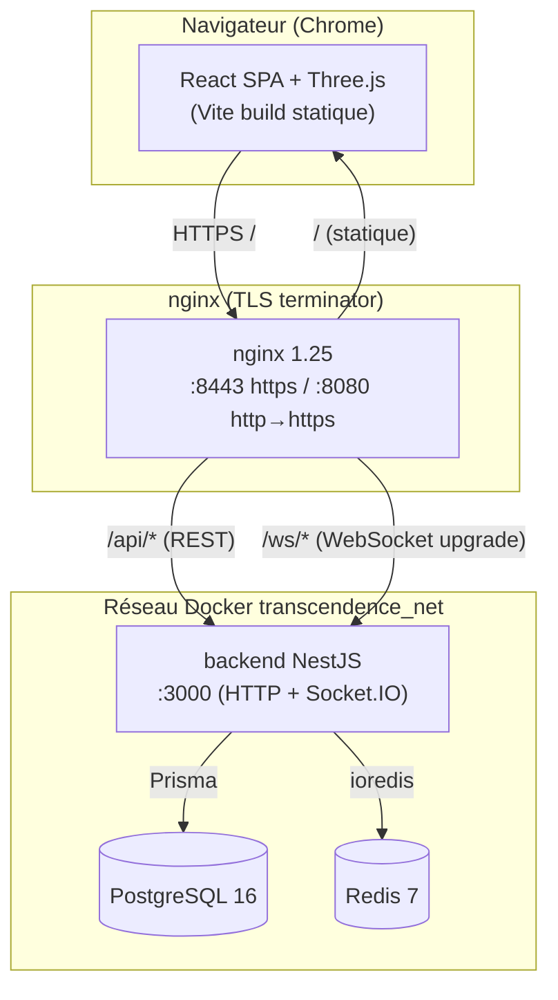
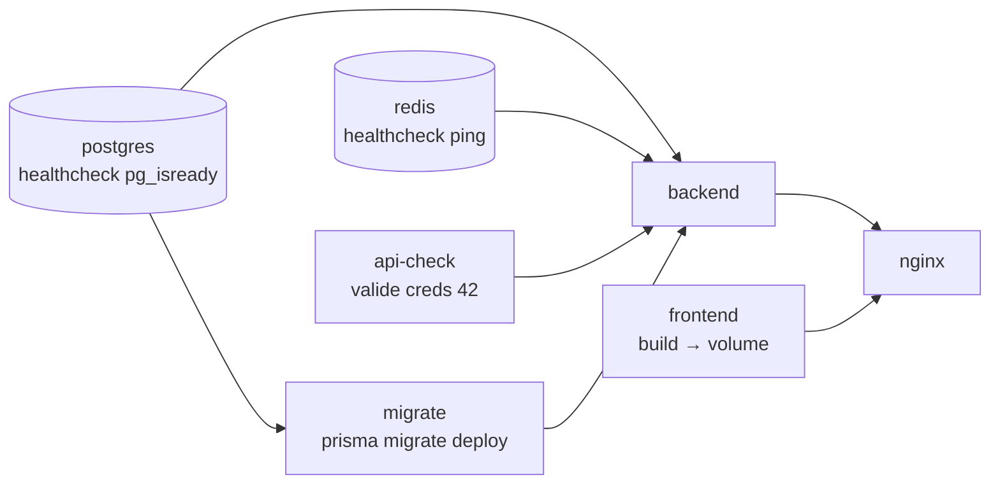
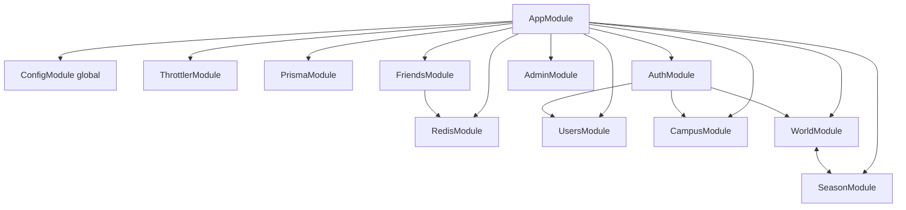
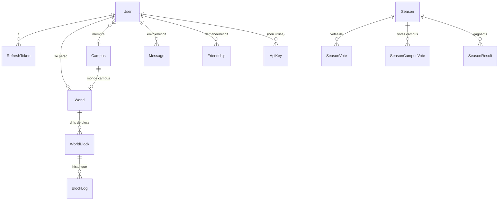
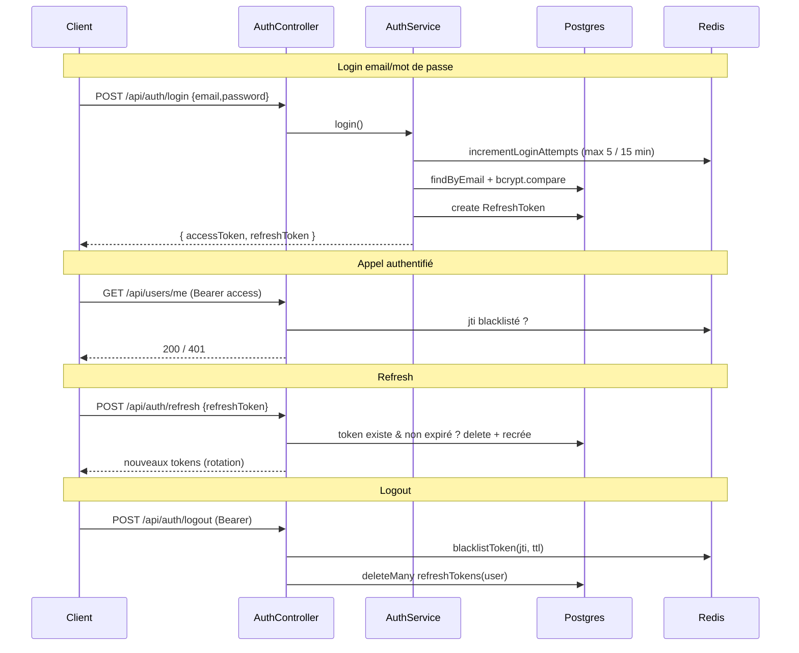
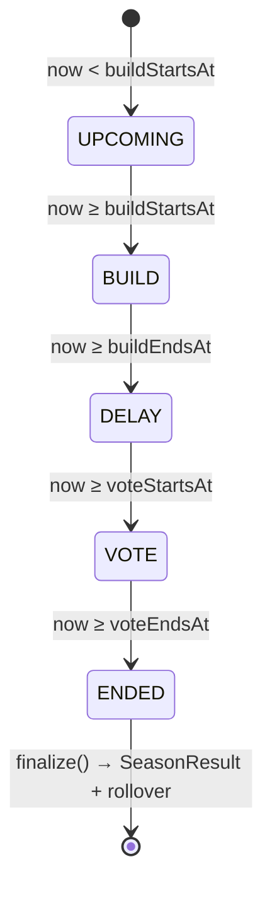
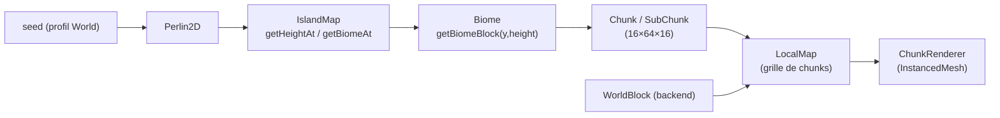
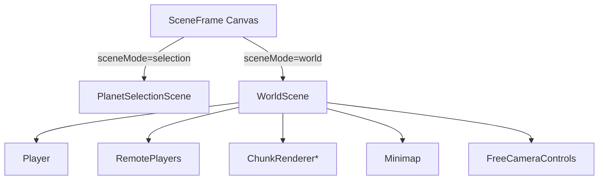
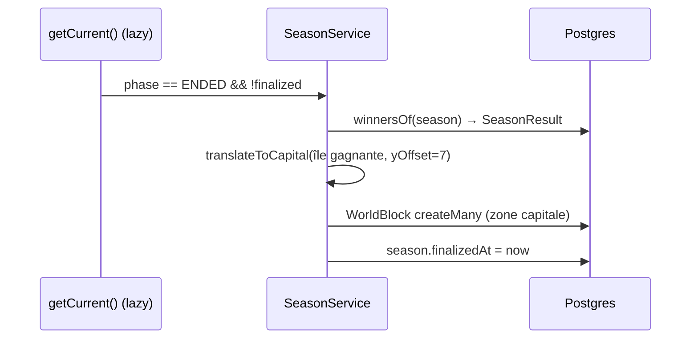

# TECH.md — FT_VERSE : documentation technique complète

> Document de soutenance. Objectif : pouvoir **re-construire le projet de zéro** en le lisant.
> Il décrit l'architecture, la base de données (Prisma/PostgreSQL), le backend (NestJS),
> le temps réel (Socket.IO/Redis), le frontend (React + Three.js) et le déploiement (Docker/nginx).

---

## 1. Vue d'ensemble

**FT_VERSE** est une application web sociale où chaque utilisateur possède une **île 3D voxel**
(monde de cubes type Minecraft) qu'il construit dans le navigateur. Les comptes **42** sont
rattachés à un **campus** ; chaque campus a son **monde partagé**. Une **saison** globale
rythme le jeu : phase de **construction**, puis **vote** sur la plus belle île, et l'île gagnante
est copiée au **centre (capitale)** du monde du campus.

Briques fonctionnelles :
- **Auth** email/mot de passe (bcrypt) + **OAuth 42** + **JWT** access/refresh + blacklist Redis.
- **Social** : amis, présence en ligne, messages privés, chat serveur global.
- **Monde 3D** temps réel : édition de blocs synchronisée entre joueurs d'une même île.
- **Économie** de campus : poser un bloc « payant » coûte des *coins* (gagnés via le logtime 42).
- **Saisons & votes** : machine à états pilotée par timestamps, podium de campus.
- **Admin** : CRUD utilisateurs, rôles, gestion campus & saisons, stats.
- **i18n** (en/fr/es), responsive/mobile (joystick virtuel), accessibilité.

---

## 2. Architecture globale



- Le **frontend** est compilé en fichiers statiques servis par nginx (volume `frontend_build`).
- **nginx** fait la terminaison TLS et route : `/` → statique, `/api/` → backend REST,
  `/ws/` → backend Socket.IO (seule location qui forwarde l'upgrade WebSocket).
- Le **backend** parle à **PostgreSQL** (données) et **Redis** (cache, blacklist JWT, présence, rate-limit).
- Tout tourne en conteneurs sur un réseau bridge privé ; seul nginx expose des ports.

---

## 3. Stack technique

| Couche | Techno | Rôle |
|--------|--------|------|
| Frontend | **React 18 + TypeScript + Vite** | SPA |
| 3D | **Three.js + @react-three/fiber + drei** | rendu voxel, caméra, lumières |
| État | **Zustand** | stores globaux légers |
| Data fetch | **Axios** + **@tanstack/react-query** | REST + cache |
| Temps réel | **socket.io-client** | sync monde + présence |
| UI | **Tailwind CSS + Radix UI (shadcn)** + lucide + sonner | design system |
| i18n | **i18next + react-i18next** | en/fr/es |
| Backend | **NestJS 11 (Express)** | API REST + WebSocket Gateways |
| ORM | **Prisma 6** | accès PostgreSQL typé + migrations |
| DB | **PostgreSQL 16** | persistance |
| Cache/éphémère | **Redis 7 (ioredis)** | blacklist JWT, cache user, présence, rate-limit login |
| Auth | **@nestjs/jwt, passport-jwt, passport-oauth2, bcrypt** | JWT + OAuth 42 |
| Validation | **class-validator / class-transformer** | DTO |
| Sécurité | **helmet, throttler, cookie-parser** | headers, rate-limit |
| Infra | **Docker Compose, nginx, Makefile** | build & run une commande |

> NB : la définition « framework » du sujet est respectée (React **et** NestJS sont des frameworks).

---

## 4. Infrastructure & déploiement

### 4.1 Démarrage en une commande

```bash
make        # = make ssl + make up
```

`Makefile` :
- `make ssl` → `scripts/gen-ssl.sh` génère un certificat TLS auto-signé dans `nginx/ssl/`.
- `make up` → `docker compose up -d --build`.
- Autres cibles : `down`, `build` (no-cache), `logs`, `clean` (volumes + prune), `re`, `ps`.

### 4.2 Services Docker (`compose.yaml`)



Ordre garanti par `depends_on` + `condition` :
1. **postgres** & **redis** healthy.
2. **api-check** : `scripts/api_verification.sh` vérifie que `API_42_CLIENT_ID/SECRET` sont valides
   (token `client_credentials`), sinon le backend ne démarre pas.
3. **migrate** : applique les migrations Prisma (`Dockerfile.migrate`).
4. **backend** démarre une fois (2)+(3) terminés et (postgres/redis) healthy.
5. **frontend** : build Vite → écrit dans le volume `frontend_build`.
6. **nginx** : sert le build + proxy vers backend.

Volumes : `postgres_data`, `redis_data`, `uploads` (avatars), `frontend_build`.
Ports exposés (hôte) : **8443** (https), **8080** (http→redirige 443).

### 4.3 Variables d'environnement (`.env.example`)

| Variable | Rôle |
|----------|------|
| `DATABASE_URL` | DSN Postgres pour Prisma |
| `REDIS_URL` / `REDIS_PASSWORD` | connexion Redis |
| `JWT_SECRET` / `JWT_REFRESH_SECRET` | signatures JWT (secrets distincts) |
| `JWT_EXPIRES_IN` (15m) / `JWT_REFRESH_EXPIRES_IN` (7d) | TTL tokens |
| `API_42_CLIENT_ID/SECRET/REDIRECT_URI` | OAuth 42 |
| `FRONTEND_URL` | origine CORS + redirection OAuth |
| `VITE_API_URL` / `VITE_WS_URL` | injectés au build front |

Les secrets sont dans `.env` (gitignored) ; `.env.example` est fourni.

### 4.4 nginx (`nginx/conf.d/default.conf`)

- `server :80` → `301 https`.
- `server :443 ssl` :
  - `location /` → `proxy_pass frontend:80` (statique).
  - `location /api/` → `proxy_pass backend:3000`.
  - `location /ws/` → `proxy_pass backend:3000` avec `Upgrade`/`Connection "Upgrade"` (WebSocket), `proxy_read_timeout 3600s`.
  - `client_max_body_size 10M`.

> **HTTPS partout** côté client (exigence sujet) ; à l'intérieur du réseau Docker la com est en clair (autorisé).

---

## 5. Backend (NestJS)

### 5.1 Carte des modules



- `main.ts` configure : préfixe global `/api`, `cookie-parser`, **ValidationPipe global**
  (`whitelist + transform + forbidNonWhitelisted`), **filtres d'exception globaux**
  (Prisma + Multer, voir §5.9), CORS (origine = `FRONTEND_URL`, credentials), sert
  `/api/uploads/*` (avatars).
- `PrismaService` étend `PrismaClient` (connect/disconnect sur les hooks de cycle de vie).
- `RedisService` enveloppe ioredis.

### 5.2 Base de données — modèles Prisma



Points clés :
- **`User`** : identité (`email?`, `username` unique, `passwordHash?`, `fortyTwoId?`), `role`
  (`USER`/`ADMIN`), profil (`displayName`, `bio`, `avatar`, `skinColor`, `language`, `theme`,
  `status`), **économie** (`coins` = gagnés via logtime 42, `coinsSpent`), `campusId?`,
  `usernameChangedAt` (cooldown 30 j). `email`/`passwordHash`/`fortyTwoId` optionnels car un
  compte peut être *email-only* ou *42-only*.
- **`RefreshToken`** : refresh tokens persistés (rotation à chaque refresh), `onDelete: Cascade`.
- **`Campus`** : `label` unique, `coins` (bonus admin, **peut devenir négatif**), relations users/world/votes.
- **`World`** : une île. Soit **perso** (`userId`), soit **campus** (`campusId`) — les deux uniques.
  Stocke le **profil de génération de terrain** (`seed`, `widthInChunks`, `octaves`, `scale`,
  `persistence`, `relief`, `baseHeight`, `variationRange`).
- **`WorldBlock`** : **diff** sur le terrain généré. Clé primaire composite `(worldId, x, y, z)`.
  `block` = valeur de l'enum Block (**0 = Air** → un bloc cassé est persisté pour creuser le sol).
  `rotation` = orientation encodée (2 bits/axe). *Le terrain de base n'est PAS stocké* : il est
  régénéré côté client de façon déterministe ; seules les modifs joueur le sont.
- **`BlockLog`** : journal des poses (qui/quand/quel bloc), pour analytics.
- **`Season`** : une saison globale. Timestamps `buildStartsAt/buildEndsAt/voteStartsAt/voteEndsAt`,
  `startedAt?` (activation paresseuse), `finalizedAt?`, `isActive`. Au plus **une** active +
  une éventuelle **en file** (queued).
- **`SeasonVote`** : 1 vote/votant/saison pour une **île** (votant et candidat même campus).
- **`SeasonCampusVote`** : pour les comptes **sans campus** → votent pour un **campus**.
- **`SeasonResult`** : île gagnante par campus d'une saison finalisée.
- **`ApiKey`** : modèle **présent mais non câblé** (API publique non implémentée — voir §10).

Migrations : `backend/prisma/migrations/` (`0_init` … `16_season_queue`). Appliquées par le
service `migrate` (`prisma migrate deploy`).

### 5.3 Authentification

Deux voies, un même format de tokens.

**Tokens (`generateTokens`)** :
- **access JWT** (TTL `JWT_EXPIRES_IN`) signé avec `JWT_SECRET`, payload `{ sub, email, username, avatar, role, campusId, jti }`.
- **refresh JWT** (TTL `JWT_REFRESH_EXPIRES_IN`) signé avec `JWT_REFRESH_SECRET`, **persisté** en base (`RefreshToken`).
- `jti` (UUID) identifie l'access token pour la **blacklist** au logout (Redis).



**OAuth 42** (`/api/auth/42` → `/api/auth/42/callback`) :
- `FortyTwoStrategy` (passport-oauth2) récupère le profil via `https://api.intra.42.fr/v2/me`.
- `validateFortyTwoUser` : lie le compte 42 (par `fortyTwoId`), sinon fusionne par email,
  sinon **crée** le user, synchronise **campus** + **coins logtime** (`FortyTwoService`),
  `ensureWorld` (crée l'île perso), gère la **race P2002** (récursion).
- Le callback **redirige** vers le front avec `access_token`/`refresh_token` (+ `is_new=1`) en query.
  Le front (`useAuth.init`) consomme ces paramètres.

**Garde & rôles** :
- `JwtAuthGuard` (passport-jwt) ; `JwtStrategy.validate` rejette un `jti` blacklisté (`Token revoked`).
- `RolesGuard` + `@Roles(Role.ADMIN)` + décorateur `@CurrentUser()`.
- Rate-limit login via Redis (`incrementLoginAttempts`, TTL 900 s, max 5).

### 5.4 Utilisateurs & profil (`users/me`)

| Route | Action |
|-------|--------|
| `GET /api/users/me` | profil courant |
| `GET /api/users/me/logtime` | logtime 42 |
| `PATCH /api/users/me` | maj profil (displayName, bio, email, language, theme, status, skinColor) |
| `POST /api/users/me/avatar` | upload avatar (Multer, type whitelisté, **4 Mo max**) |
| `PATCH /api/users/me/username` | changer pseudo (**cooldown 30 j**, unicité) |
| `PATCH /api/users/me/password` | changer mot de passe (vérifie l'actuel) |
| `DELETE /api/users/me` | supprimer son compte |

- **Upload avatar** : `avatarMulterOptions` (`diskStorage`, nom = UUID, `fileFilter` extension,
  `limits.fileSize = 4 Mo`). Stocké dans le volume `uploads`, servi via `/api/uploads/avatars`.
- Cache user en Redis (`cacheUser`, TTL 300 s) invalidé sur modif.

### 5.5 Social : amis, messages, présence

- **Amis** (`/api/friends`) : liste, profil d'un ami, suppression.
- **Demandes** (`/api/friends/requests`) : `incoming`, `outgoing`, envoyer, accepter, refuser.
  Modèle `Friendship(status PENDING|ACCEPTED)`, unique `(requester,addressee)`.
- **Messages** (`/api/friends/:friendId/messages`) : historique + envoi (sous `ThrottlerGuard`).
- **Présence** : `PresenceService` (en mémoire, ref-count par sockets) → in/out de ligne diffusés.
- **`FriendsGateway`** (namespace racine, `path /ws/socket.io`) : présence, chat serveur global
  (`server:chat`), avatars live, déconnexion du **double login** (kick `concurrent_login`).

### 5.6 Campus & économie de coins

- `Campus` : `coins` = **bonus admin** (modifiable, peut être négatif). Chaque `User` a `coins`
  gagnés via le **logtime 42** (re-sync à chaque login).
- **Budget de construction d'un campus** = `campus.coins (bonus) + Σ membres.coins`.
- Poser un bloc **payant** coûte 1 (débité du *bonus* persisté), casser un bloc payant rembourse 1.
  Les blocs « gratuits » (terrain : Stone, Dirt, Grass, Wood, Leaves, Water, Sand, Gravel, Sandstone)
  ne coûtent rien. Voir `world.blocks.ts` (`FREE_BLOCKS`, `isPaidBlock`).
- Routes admin : CRUD campus + ajout/retrait de membres.

### 5.7 Saisons & votes

Machine à états **dérivée des timestamps** (pas de cron : auto-réparation à la lecture).



- `phaseOf(season, now)` calcule la phase. `getCurrent()` **auto-finalise** une saison dont le
  vote est écoulé et **active** une saison en file dont la build a commencé (`activate`, claim
  atomique via `updateMany` pour éviter les doubles activations concurrentes).
- **Édition gelée** hors phase BUILD : le gateway monde renvoie `world:revert` + `world:locked`.
- **Vote** (`POST /api/season/vote`) : 1 vote/saison, votant et île **même campus**, pas de
  vote pour sa propre île. Comptes sans campus → `vote-campus`.
- **Finalize/rollover** (`finalize` / `rollOverWorlds`) : calcule les gagnants par campus
  (`winnersOf`), écrit `SeasonResult`, marque `finalizedAt`, puis **reconstruit** chaque capitale
  de campus à partir de l'île gagnante.

**`translateToCapital`** (copie de l'île gagnante au centre du monde campus) :
- Filtre les blocs dans la zone de claim (64×64 = 4×4 chunks).
- **Aligne le sol fixe de l'île perso** (`PRIVATE_GROUND_HEIGHT = 5`) sur la **surface plate de la
  capitale** (`FLAT_CENTER_HEIGHT = 12`) → `yOffset = 12 - 5 = 7` (décalage **constant**, pas un
  drop basé sur le bloc le plus bas, sinon les builds creusés/au sol flottent).
- Réancre sur `CAPITAL_ORIGIN` (centre du monde 32×32 chunks).

### 5.8 Monde 3D — REST + temps réel

**REST (`/api/world`)** :
| Route | Action |
|-------|--------|
| `GET /api/world` | liste des mondes campus (profils de terrain) |
| `GET /api/world/:campusId` | détail + **diffs de blocs** d'un monde |
| `POST /api/world/:campusId/blocks` | sauvegarde de blocs (fallback REST) |

**WebSocket — `WorldGateway`** (namespace `/world`, `path /ws/socket.io`) :

| Event (client→serveur) | Rôle |
|------------------------|------|
| `world:join` | rejoindre une île (campus room ou `world:personal:<userId>`) ; renvoie snapshot des joueurs + coins |
| `world:leave` | quitter la room |
| `player:move` | diffuser sa position/rotation/skin (throttle ~15 Hz côté client) |
| `world:edit` | poser/casser des blocs (batch) |
| `world:lookup` | inspecter un bloc (qui l'a posé) |

| Event (serveur→client) | Rôle |
|------------------------|------|
| `world:players` | snapshot des autres joueurs à l'arrivée |
| `player:move` / `player:leave` / `player:avatar` | présence live |
| `world:resync` | demande de ré-annonce de position |
| `world:edit` | blocs acceptés relayés aux pairs |
| `world:revert` | blocs rejetés (à annuler côté client) |
| `world:coins` | budget de campus mis à jour |
| `world:locked` | édition refusée (hors phase BUILD) |
| `world:reset` | nouvelle saison (rechargement) |
| `auth:kick` | double login |

**`world:edit` (cœur)** :
1. Vérifie l'appartenance à la room et au campus (seuls les **comptes 42 avec campus** éditent ;
   un campus n'est éditable que par ses membres).
2. Refuse hors **phase BUILD**.
3. Sanitize (bornes `MAP_WIDTH 512`, `MAP_HEIGHT 64`, `MAX_BLOCK 249`, `MAX_BATCH 4096`).
4. **Île perso** : persiste + relaie. **Campus** : `applyEdits` (économie de coins en transaction).

**`applyEdits` (transaction Prisma)** :
- Verrouille le campus le temps de la transaction (anti-race sur les coins).
- Budget = bonus + Σ coins membres. Rejette : blocs invalides, Bedrock, **zone centrale protégée**
  (4×4 chunks = la capitale), blocs payants si budget ≤ 0.
- Débite/rembourse, `createMany`/`update` des `WorldBlock`, écrit `BlockLog`, persiste le nouveau
  bonus sur `campus.coins`. Renvoie `{ applied, rejected, coins }`.

### 5.9 Gestion d'erreurs & validation (anti-500)

- **ValidationPipe global** : `whitelist` (retire les champs inconnus), `forbidNonWhitelisted`
  (rejette), `transform`. Messages de validation **stables** (`common/validation-messages.ts`) →
  traduisibles côté front.
- **Filtres d'exception globaux** (`common/filters/`) :
  - `PrismaExceptionFilter` : `P2002 → 409`, `P2025 → 404`, `P2003 → 400`, autres → 500 *loggé sans fuite*.
  - `MulterExceptionFilter` : `LIMIT_FILE_SIZE → 413`, autre → 400.
- **Races** : `catch` P2002 explicite dans `register` et `changeUsername` (messages traduits).
- **Cache corrompu** : `JSON.parse` Redis protégé (miss + purge).
- Sans `HttpException`, NestJS renvoie un 500 propre (pas de stack divulguée).

### 5.10 Redis — usages

| Clé / fonction | Rôle |
|----------------|------|
| `blacklist:<jti>` | invalidation d'access token (logout) |
| `user:<id>` (cacheUser) | cache profil (TTL 300 s) |
| `login_attempts:<email>` | rate-limit login (TTL 900 s, max 5) |
| `getRaw/setRaw` | usage générique |

---

## 6. Frontend (React)

### 6.1 Arborescence `src/`

```
generation/   noise (Perlin2D) + terrain (IslandMap, Biome, MapConfig)  → génération voxel
types/maps/   Chunk, SubChunk, LocalMap                                  → structures de données monde
store/        Zustand : auth, planetStore, editorStore, settings, season, admin,
              worldEconomy, lookupStore, remotePlayersStore, friends/*
lib/          api.ts (axios), apiError.ts, jwt.ts, permissions.ts, user.ts,
              api/* (account, admin, campus, season, world), sockets/* (worldSocket)
i18n/         index.ts + locales/{en,fr,es}.json
ui/shadcn/    primitives Radix/Tailwind
ui/hud/       overlays 2D (auth, friends, chat, settings, admin, editor, tutorial…)
ui/three/     Canvas R3F : SceneFrame, scenes/ (WorldScene, PlanetSelectionScene),
              objects/ (Player, RemotePlayers, SelectablePlanet)
```

### 6.2 État & flux applicatif

`App.tsx` orchestre :
- `useAuth.init()` consomme les tokens OAuth de l'URL, restaure la session.
- Quand `user` change : connecte/déconnecte les sockets temps réel, charge les préférences
  (thème, langue), bascule `sceneMode` (`selection` ↔ `world`).
- Rendu : `<SceneFrame/>` (Canvas 3D) + `<HUDFrame/>` (overlays 2D) + `<Toaster/>`.

Stores Zustand notables : `auth` (session), `planetStore` (mode scène, monde actif,
île privée/visite), `editorStore` (mode éditeur/freecam), `worldEconomy` (coins live),
`remotePlayersStore` (autres joueurs), `season`, `settings`.

### 6.3 Couche API (`lib/api.ts`)

- Instance axios `baseURL = VITE_API_URL`.
- **Intercepteur requête** : refresh **proactif** de l'access token s'il expire bientôt
  (`isTokenExpired(token, 10s)`) ; sérialise les refresh concurrents (`refreshing`).
- **Intercepteur réponse** : sur 401, tente un refresh puis rejoue, sinon déclenche le handler
  de déconnexion.
- `apiError.toMessage()` mappe les messages backend (anglais) → clés `errors.*` traduites
  (table `SERVER_ERROR_KEYS` + regex pour le cooldown username dynamique).

### 6.4 i18n

- `i18next` + détecteur (localStorage → navigator), `fallbackLng: en`, 3 langues complètes
  (clés strictement identiques en/fr/es). Sélecteur de langue dans les réglages.
- Tout texte UI passe par `t(...)` ; les messages serveur sont re-localisés via `apiError`.

### 6.5 Pipeline de génération 3D (déterministe, côté client)



- **`Perlin2D`** : bruit de Perlin seedé (`seedrandom`) → reproductible.
- **`IslandMap`** : combine plusieurs octaves + **contraintes** : centre plat (capitale à hauteur 12,
  biome Plains), bords aplatis (bord de l'île), interpolation entre biomes (Desert/Plains/Forest/Mountain).
- **`Biome.getBiomeBlock(biome, y, height)`** : choisit le bloc par couche (surface herbe/sable,
  sous-sol terre, profond pierre, sommets gravier).
- **`Chunk`** (16×64×16) = 4 `SubChunk` (16³) + rotations ; **`LocalMap`** = grille de chunks
  (coordonnées globales).
- **`WorldScene.generateLocalMap`** : génère le terrain, plante des arbres (déterministe par hash),
  puis **applique les `WorldBlock`** récupérés du backend par-dessus (édition/creusage).
  Pour une **île perso** : sol **plat** forcé à hauteur 5, biome Plains.
- Rendu : `ChunkRenderer` regroupe les faces visibles par type de bloc en **`THREE.InstancedMesh`**
  (perf : milliers de cubes), culling des faces internes, chunks chargés selon `renderDistance`.

### 6.6 Scènes & joueur



- **PlanetSelectionScene** : carrousel d'îles (une par campus) ; charge `listWorlds()` avec
  **retry backoff** sur erreurs transitoires (502/503/504), suppression du 401.
- **WorldScene** : monde actif. Mode **joueur** (3e personne, collision, gravité) ou **freecam**
  (édition, touche `c`, réservé aux comptes 42 sur leur monde). Édition de blocs → `world:edit`
  optimiste + réconciliation via `world:coins`/`world:revert`. Minimap, ombres dynamiques.
- **RemotePlayers** : avatars des autres joueurs (position/rotation/skin live via `remotePlayersStore`).

### 6.7 Temps réel côté client (`lib/sockets/worldSocket.ts`, `store/friends/socket.ts`)

- `connectWorldSocket()` : `io('/world', { path:'/ws/socket.io', auth: token, transports:['websocket'] })`,
  token rafraîchi avant connexion.
- Socket **friends** : namespace racine (présence, chat, demandes).
- Reconnexion gérée (ré-annonce de présence, re-join des rooms).

---

## 7. Flux de bout en bout (exemples)

**Poser un bloc sur une île de campus** :
```mermaid
sequenceDiagram
  participant U as Joueur (front)
  participant WG as WorldGateway
  participant WS as WorldService (tx)
  participant DB as Postgres
  participant P as Pairs (même île)

  U->>WG: world:edit {campusId, blocks[]}
  WG->>WG: room ? campus ? phase=BUILD ?
  WG->>WS: applyEdits(campusId, blocks, userId)
  WS->>DB: lock campus + lire blocs + coins
  WS->>DB: createMany/update WorldBlock + BlockLog + campus.coins
  WS-->>WG: {applied, rejected, coins}
  WG-->>P: world:edit {applied}
  WG-->>U: world:coins {coins} ; world:revert {rejected}
```

**Fin de saison → capitale** :


---

## 8. Mapping modules du sujet (14 points)

> À refléter/justifier dans le `README.md` (section Modules).

- **Web** : framework front+back (Major) · WebSockets temps réel (Major) · interaction utilisateurs
  chat+profil+amis (Major) · ORM Prisma (Minor).
- **User Management** : gestion standard + avatar + statut en ligne (Major) · OAuth 42 (Minor) ·
  permissions avancées / rôles admin (Major).
- **Accessibilité & i18n** : 3 langues + sélecteur (Minor). *(RTL non implémenté — ne pas revendiquer.)*
- **Gaming / UX** : graphismes **3D avancés** Three.js (Major).

Vérifier le total ≥ 14 ; chaque module doit être **démontrable** (sinon 0).

---

## 9. Refaire le projet — pas à pas

1. **Scaffold** : monorepo `frontend/` (Vite React TS) + `backend/` (NestJS) + `nginx/` + `compose.yaml` + `Makefile`.
2. **DB** : modèle Prisma (§5.2), `prisma migrate dev` pour générer les migrations.
3. **Auth** : module Auth (JWT access/refresh, bcrypt, blacklist Redis, guards, RolesGuard),
   puis OAuth 42 (passport-oauth2 + `FortyTwoService`).
4. **Users/Friends/Campus** : CRUD + DTO validés + presence + messages.
5. **Temps réel** : `FriendsGateway` (présence/chat) et `WorldGateway` (sync monde), auth socket via JWT.
6. **Monde** : profil de terrain par monde, `WorldBlock` (diffs), `applyEdits` (économie en transaction),
   protection de la zone centrale.
7. **Saisons** : machine à états par timestamps, votes, finalize + `translateToCapital`.
8. **Génération 3D front** : `Perlin2D → IslandMap → Biome → Chunk/LocalMap`, rendu `InstancedMesh`,
   appliquer les `WorldBlock` par-dessus.
9. **Frontend app** : stores Zustand, axios + refresh proactif, i18n, scènes R3F (sélection/monde),
   joueur + freecam + édition.
10. **Robustesse** : ValidationPipe + filtres d'exception (Prisma/Multer), HTTPS nginx,
    pages Privacy/Terms, responsive/mobile.
11. **Infra** : Dockerfiles (back, front, migrate), `compose.yaml` (healthchecks + ordre),
    `make` (ssl + up).

---

## 10. Pièges & dette connue

- **`ApiKey`** : modèle en base mais **aucune API publique câblée** (le module Web « public API »
  n'est pas implémenté). Ne pas le revendiquer.
- **RTL** (i18n) : non implémenté.
- `ErrorBoundary` conserve un `console.error` (uniquement sur crash WebGL réel — diagnostic).
- Le terrain de base n'est jamais persisté : toute évolution de l'algorithme de génération change
  l'aspect des mondes existants (les diffs `WorldBlock` restent valides car indexés en coordonnées).
- `campus.coins` peut être **négatif** (le budget consomme d'abord les coins des membres, puis le bonus).

---

## 11. Glossaire

| Terme | Définition |
|-------|------------|
| **Île / World** | monde voxel d'un user (perso) ou d'un campus (partagé) |
| **Chunk / SubChunk** | colonne 16×64×16 / segment 16³ de blocs |
| **WorldBlock** | diff (bloc modifié) sur le terrain généré ; Air=0 = bloc cassé |
| **Capitale** | zone centrale 4×4 chunks d'un monde campus, où atterrit l'île gagnante |
| **Coins** | monnaie de construction (membres : logtime 42 ; campus : bonus admin) |
| **Bloc payant** | tout bloc hors terrain de base ; coûte 1 coin à poser |
| **Phase** | UPCOMING/BUILD/DELAY/VOTE/ENDED, dérivée des timestamps de saison |
| **jti** | identifiant d'un access token, sert à la blacklist au logout |
```
